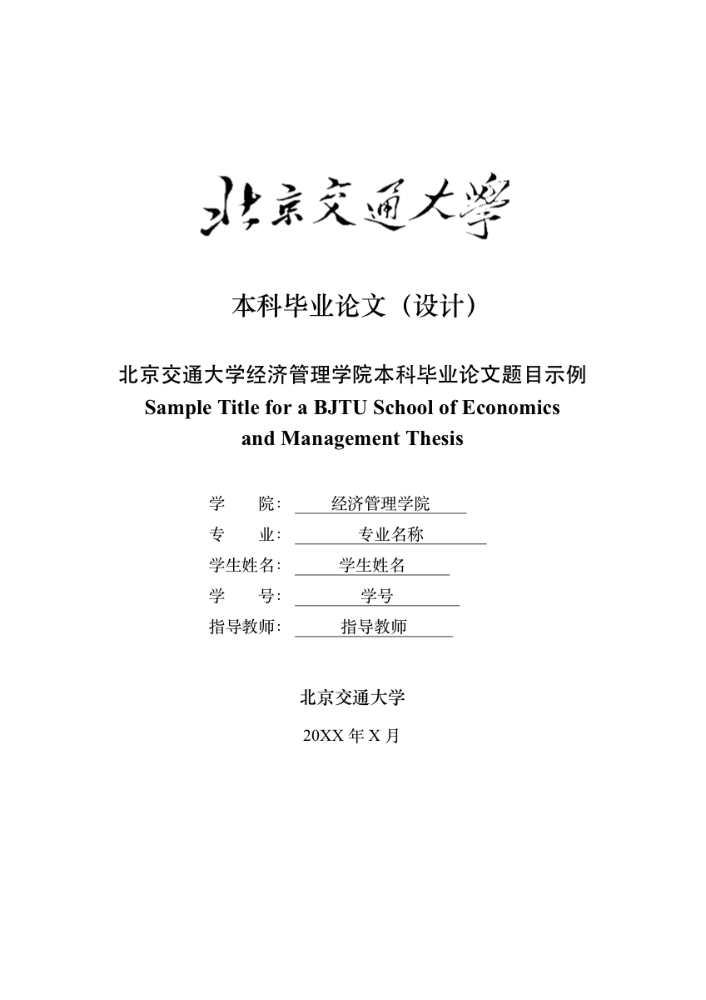

# 北京交通大学经济管理学院本科毕业论文 LaTeX 模板

面向北京交通大学经济管理学院本科毕业论文（设计）的非官方 LaTeX 模板。仓库提供可直接编译的封面、授权书、诚信声明、中英文摘要、目录、正文、参考文献、致谢和附录结构，目标是保持“下载后即可本地编译，也可直接上传 Overleaf”的使用体验。



正式提交前，请务必继续对照学院或学校最新格式要求自行复核。本仓库更适合作为可维护、可扩展、可公开协作的模板基础。

## 特性

- 基于 `ctexbook`，默认使用 `XeLaTeX`
- 已预设封面、前置部分、目录、正文和后置部分结构
- 正文、图、表、公式按章编号
- 已实现学校样式风格的页眉、页码和章节层级
- 示例内容均为通用占位文本，不含真实学生信息
- 兼顾本地编译和 Overleaf 上传场景
- 自带示例 PDF 与预览图，便于发布和回归检查

## 快速开始

### Overleaf

1. 下载并解压仓库源码。
2. 在 Overleaf 创建 `Blank Project`。
3. 将仓库根目录下的文件和目录直接上传到项目根目录。
4. 将编译器设置为 `XeLaTeX`。
5. 点击 `Recompile`；若目录或交叉引用未更新，再编译一次。

### 本地编译

仓库根目录执行：

```bash
make pdf
```

如果没有 `make`，也可以直接执行：

```bash
xelatex -interaction=nonstopmode -halt-on-error main.tex
xelatex -interaction=nonstopmode -halt-on-error main.tex
```

## 仓库结构

- `main.tex`：主入口，填写封面信息并组织全文
- `bjtuthesis.cls`：模板类文件，控制版式和核心命令
- `frontmatter/`：中英文摘要示例
- `chapters/`：正文各章示例
- `backmatter/`：参考文献、致谢、附录示例
- `assets/`：模板静态资源
- `docs/usage.md`：详细使用说明
- `docs/sample.pdf`：当前示例编译产物
- `docs/preview.png`：README 展示预览图

## 常用操作

修改 `main.tex` 中的封面字段：

```tex
\thesistitlecn{你的中文题目}
\thesistitleen{Your English Title}
\thesiscollege{经济管理学院}
\thesismajor{你的专业}
\thesisauthor{你的姓名}
\thesisstudentid{你的学号}
\thesisadvisor{你的导师}
\thesisdate{2026年6月}
```

更多说明见 [docs/usage.md](docs/usage.md)。

## 维护与发布

- 贡献说明见 [CONTRIBUTING.md](CONTRIBUTING.md)
- 示例产物可通过 `make sample` 和 `make preview` 更新
- 提交前请不要把本地临时编译文件一并加入版本控制

## 许可证

本仓库的源代码和文档默认采用 [MIT License](LICENSE)。

学校题字图片、校名及其他机构标识的使用范围请参考 [NOTICE.md](NOTICE.md) 中的说明，自行确认后再用于公开分发或正式提交。
